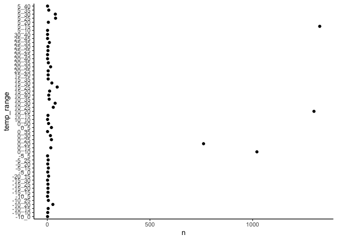
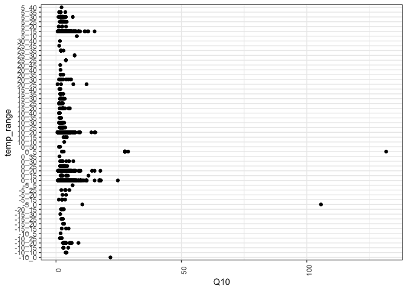

data exploration
================

------------------------------------------------------------------------

## SRDB data

examining the different variables/levels in the dataset

**Biome**

    #> [1] ""              "Arctic"        "Boreal"       
    #> [4] "Mediterranean" "Subtropical"   "Temperate"    
    #> [7] "Tropical"

**Ecosystem\_type**

    #> [1] "Agriculture" "Bare"        "Desert"     
    #> [4] "Forest"      "Grassland"   "Savanna"    
    #> [7] "Shrubland"   "Tundra"      "Wetland"

**Meas\_method**

    #> [1] ""                   "Alkali absorption" 
    #> [3] "Gas chromatography" "Gradient"          
    #> [5] "IRGA"               "Unknown"

**Q10 temp\_range**

number of observations per temperature range

| temp\_range |    n |
|:------------|-----:|
| -10\_0      |    1 |
| -10\_10     |    2 |
| -10\_15     |    4 |
| -10\_20     |   27 |
| -10\_25     |    5 |
| -10\_5      |    1 |
| -15\_15     |    3 |
| -15\_20     |    3 |
| -15\_25     |    3 |
| -15\_30     |    1 |
| -20\_15     |    6 |
| -5\_0       |    2 |
| -5\_15      |    5 |
| -5\_20      |    2 |
| -5\_25      |    4 |
| -5\_5       |    1 |
| 0\_10       | 1021 |
| 0\_15       |   17 |
| 0\_20       |  761 |
| 0\_25       |   20 |
| 0\_30       |   15 |
| 0\_35       |    1 |
| 0\_5        |   20 |
| 0\_50       |    6 |
| 10\_10      |    1 |
| 10\_15      |    3 |
| 10\_20      | 1299 |
| 10\_25      |   29 |
| 10\_30      |   38 |
| 10\_35      |    9 |
| 10\_40      |    7 |
| 15\_20      |   11 |
| 15\_25      |   48 |
| 15\_30      |   22 |
| 15\_35      |    4 |
| 15\_40      |    4 |
| 20\_25      |    4 |
| 20\_30      |   16 |
| 20\_35      |    5 |
| 20\_40      |    1 |
| 20\_45      |    1 |
| 25\_25      |    3 |
| 25\_30      |    3 |
| 25\_35      |   10 |
| 25\_45      |    1 |
| 30\_40      |    1 |
| 5\_10       |    1 |
| 5\_15       | 1327 |
| 5\_20       |    5 |
| 5\_25       |   40 |
| 5\_30       |   39 |
| 5\_35       |    7 |
| 5\_40       |    1 |

<!-- -->

Q10 values by temperature range

<!-- -->

------------------------------------------------------------------------

Session Info

Date run: 2021-03-31

    #> R version 4.0.2 (2020-06-22)
    #> Platform: x86_64-apple-darwin17.0 (64-bit)
    #> Running under: macOS Catalina 10.15.7
    #> 
    #> Matrix products: default
    #> BLAS:   /System/Library/Frameworks/Accelerate.framework/Versions/A/Frameworks/vecLib.framework/Versions/A/libBLAS.dylib
    #> LAPACK: /Library/Frameworks/R.framework/Versions/4.0/Resources/lib/libRlapack.dylib
    #> 
    #> locale:
    #> [1] en_US.UTF-8/en_US.UTF-8/en_US.UTF-8/C/en_US.UTF-8/en_US.UTF-8
    #> 
    #> attached base packages:
    #> [1] stats     graphics  grDevices utils    
    #> [5] datasets  methods   base     
    #> 
    #> other attached packages:
    #>  [1] sf_0.9-8                rnaturalearthdata_0.1.0
    #>  [3] rnaturalearth_0.1.0     drake_7.13.1           
    #>  [5] forcats_0.5.1           stringr_1.4.0          
    #>  [7] dplyr_1.0.4             purrr_0.3.4            
    #>  [9] readr_1.4.0             tidyr_1.1.2            
    #> [11] tibble_3.0.6            ggplot2_3.3.3          
    #> [13] tidyverse_1.3.0        
    #> 
    #> loaded via a namespace (and not attached):
    #>  [1] nlme_3.1-152       fs_1.5.0          
    #>  [3] lubridate_1.7.9.2  filelock_1.0.2    
    #>  [5] progress_1.2.2     httr_1.4.2        
    #>  [7] tools_4.0.2        backports_1.2.1   
    #>  [9] utf8_1.1.4         R6_2.5.0          
    #> [11] KernSmooth_2.23-18 AlgDesign_1.2.0   
    #> [13] rgeos_0.5-5        DBI_1.1.1         
    #> [15] questionr_0.7.4    colorspace_2.0-0  
    #> [17] measurements_1.4.0 sp_1.4-5          
    #> [19] withr_2.4.1        tidyselect_1.1.0  
    #> [21] prettyunits_1.1.1  klaR_0.6-15       
    #> [23] compiler_4.0.2     cli_2.2.0         
    #> [25] rvest_0.3.6        xml2_1.3.2        
    #> [27] labeling_0.4.2     scales_1.1.1      
    #> [29] classInt_0.4-3     digest_0.6.27     
    #> [31] txtq_0.2.3         rmarkdown_2.6.6   
    #> [33] pkgconfig_2.0.3    htmltools_0.5.1.1 
    #> [35] labelled_2.7.0     maps_3.3.0        
    #> [37] dbplyr_2.0.0       fastmap_1.1.0     
    #> [39] highr_0.8          rlang_0.4.10      
    #> [41] readxl_1.3.1       rstudioapi_0.13   
    #> [43] shiny_1.6.0        farver_2.0.3      
    #> [45] generics_0.1.0     combinat_0.0-8    
    #> [47] jsonlite_1.7.2     magrittr_2.0.1    
    #> [49] Rcpp_1.0.6         munsell_0.5.0     
    #> [51] fansi_0.4.2        lifecycle_0.2.0   
    #> [53] stringi_1.5.3      yaml_2.2.1        
    #> [55] MASS_7.3-53        storr_1.2.5       
    #> [57] grid_4.0.2         parallel_4.0.2    
    #> [59] promises_1.1.1     crayon_1.4.0      
    #> [61] miniUI_0.1.1.1     lattice_0.20-41   
    #> [63] haven_2.3.1        mapproj_1.2.7     
    #> [65] hms_1.0.0          knitr_1.31        
    #> [67] pillar_1.4.7       igraph_1.2.6      
    #> [69] base64url_1.4      reprex_1.0.0      
    #> [71] glue_1.4.2         evaluate_0.14     
    #> [73] agricolae_1.3-3    modelr_0.1.8      
    #> [75] vctrs_0.3.6        httpuv_1.5.5      
    #> [77] cellranger_1.1.0   gtable_0.3.0      
    #> [79] assertthat_0.2.1   xfun_0.20         
    #> [81] mime_0.9           xtable_1.8-4      
    #> [83] broom_0.7.4        e1071_1.7-4       
    #> [85] later_1.1.0.1      rsconnect_0.8.16  
    #> [87] class_7.3-18       units_0.7-1       
    #> [89] cluster_2.1.0      ellipsis_0.3.1

