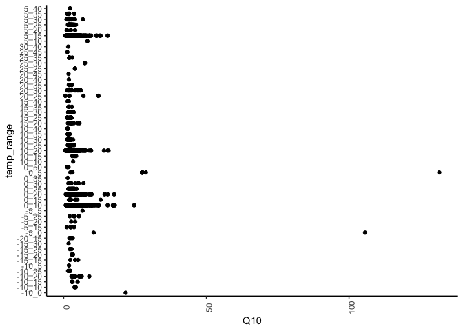

data exploration
================

------------------------------------------------------------------------

## SRDB data

examining the different variables/levels in the dataset

**Biome**

    #> [1] ""              "Arctic"        "Boreal"        "Mediterranean"
    #> [5] "Subtropical"   "Temperate"     "Tropical"

**Ecosystem\_type**

    #> [1] "Agriculture" "Bare"        "Desert"      "Forest"      "Grassland"  
    #> [6] "Savanna"     "Shrubland"   "Tundra"      "Wetland"

**Meas\_method**

    #> [1] ""                   "Alkali absorption"  "Gas chromatography"
    #> [4] "Gradient"           "IRGA"               "Unknown"

**Q10 temp\_range**

number of observations per temperature range

| temp\_range |    n |
|:------------|-----:|
| -10\_0      |    1 |
| -10\_10     |    2 |
| -10\_15     |    4 |
| -10\_20     |   27 |
| -10\_25     |    5 |
| -10\_5      |    1 |
| -15\_15     |    3 |
| -15\_20     |    3 |
| -15\_25     |    3 |
| -15\_30     |    1 |
| -20\_15     |    6 |
| -5\_0       |    2 |
| -5\_15      |    5 |
| -5\_20      |    2 |
| -5\_25      |    4 |
| -5\_5       |    1 |
| 0\_10       | 1021 |
| 0\_15       |   17 |
| 0\_20       |  761 |
| 0\_25       |   20 |
| 0\_30       |   15 |
| 0\_35       |    1 |
| 0\_5        |   20 |
| 0\_50       |    6 |
| 10\_10      |    1 |
| 10\_15      |    3 |
| 10\_20      | 1299 |
| 10\_25      |   29 |
| 10\_30      |   38 |
| 10\_35      |    9 |
| 10\_40      |    7 |
| 15\_20      |   11 |
| 15\_25      |   48 |
| 15\_30      |   22 |
| 15\_35      |    4 |
| 15\_40      |    4 |
| 20\_25      |    4 |
| 20\_30      |   16 |
| 20\_35      |    5 |
| 20\_40      |    1 |
| 20\_45      |    1 |
| 25\_25      |    3 |
| 25\_30      |    3 |
| 25\_35      |   10 |
| 25\_45      |    1 |
| 30\_40      |    1 |
| 5\_10       |    1 |
| 5\_15       | 1327 |
| 5\_20       |    5 |
| 5\_25       |   40 |
| 5\_30       |   39 |
| 5\_35       |    7 |
| 5\_40       |    1 |

<!-- -->

Q10 values by temperature range

<!-- -->

------------------------------------------------------------------------

Session Info

Date run: 2021-03-17

    #> R version 4.0.2 (2020-06-22)
    #> Platform: x86_64-apple-darwin17.0 (64-bit)
    #> Running under: macOS Catalina 10.15.7
    #> 
    #> Matrix products: default
    #> BLAS:   /System/Library/Frameworks/Accelerate.framework/Versions/A/Frameworks/vecLib.framework/Versions/A/libBLAS.dylib
    #> LAPACK: /Library/Frameworks/R.framework/Versions/4.0/Resources/lib/libRlapack.dylib
    #> 
    #> locale:
    #> [1] en_US.UTF-8/en_US.UTF-8/en_US.UTF-8/C/en_US.UTF-8/en_US.UTF-8
    #> 
    #> attached base packages:
    #> [1] stats     graphics  grDevices utils     datasets  methods   base     
    #> 
    #> other attached packages:
    #>  [1] forcats_0.5.1   stringr_1.4.0   dplyr_1.0.4     purrr_0.3.4    
    #>  [5] readr_1.4.0     tidyr_1.1.2     tibble_3.0.6    ggplot2_3.3.3  
    #>  [9] tidyverse_1.3.0 drake_7.13.1   
    #> 
    #> loaded via a namespace (and not attached):
    #>  [1] storr_1.2.5       progress_1.2.2    xfun_0.20         tidyselect_1.1.0 
    #>  [5] haven_2.3.1       colorspace_2.0-0  vctrs_0.3.6       generics_0.1.0   
    #>  [9] htmltools_0.5.1.1 yaml_2.2.1        rlang_0.4.10      pillar_1.4.7     
    #> [13] withr_2.4.1       txtq_0.2.3        glue_1.4.2        DBI_1.1.1        
    #> [17] dbplyr_2.0.0      modelr_0.1.8      readxl_1.3.1      lifecycle_0.2.0  
    #> [21] munsell_0.5.0     gtable_0.3.0      cellranger_1.1.0  rvest_0.3.6      
    #> [25] evaluate_0.14     labeling_0.4.2    knitr_1.31        parallel_4.0.2   
    #> [29] fansi_0.4.2       highr_0.8         broom_0.7.4       Rcpp_1.0.6       
    #> [33] backports_1.2.1   scales_1.1.1      filelock_1.0.2    jsonlite_1.7.2   
    #> [37] farver_2.0.3      fs_1.5.0          hms_1.0.0         digest_0.6.27    
    #> [41] stringi_1.5.3     grid_4.0.2        cli_2.2.0         tools_4.0.2      
    #> [45] magrittr_2.0.1    base64url_1.4     crayon_1.4.0      pkgconfig_2.0.3  
    #> [49] ellipsis_0.3.1    xml2_1.3.2        prettyunits_1.1.1 reprex_1.0.0     
    #> [53] lubridate_1.7.9.2 rmarkdown_2.6.6   assertthat_0.2.1  httr_1.4.2       
    #> [57] rstudioapi_0.13   R6_2.5.0          igraph_1.2.6      compiler_4.0.2

