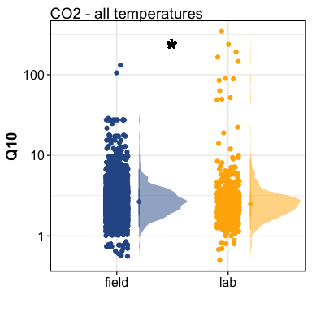
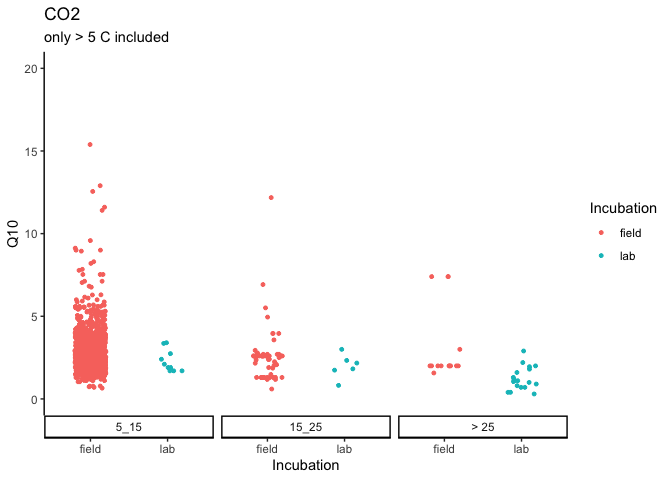
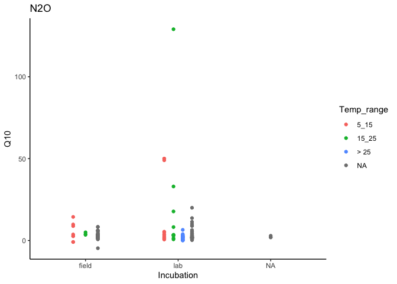
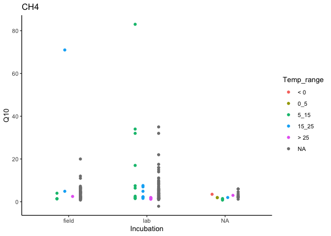

data analysis
================

------------------------------------------------------------------------

## Study sites

<!-- -->

How many datapoints?

| Species | field | lab |  NA |
|:--------|------:|----:|----:|
| CH4     |    61 | 132 |  19 |
| CO2     |  4942 |  77 |   2 |
| N2O     |    52 |  98 |   3 |
| NA      |    NA |  44 |  NA |

How many studies?

| Species | field | lab |  NA |
|:--------|------:|----:|----:|
| CH4     |    27 |  21 |  10 |
| CO2     |   598 |  19 |   2 |
| N2O     |    22 |  23 |   2 |
| NA      |    NA |  16 |  NA |

------------------------------------------------------------------------

## Field vs. lab

### Stats

CO2 - by temperature

    #> # A tibble: 3 x 7
    #> # Groups:   Temp_range [3]
    #>   Temp_range term          df sumsq meansq statistic p_value
    #>   <fct>      <chr>      <dbl> <dbl>  <dbl>     <dbl>   <dbl>
    #> 1 5_15       Incubation     1  3.90   3.90     2.39  0.122  
    #> 2 15_25      Incubation     1  1.75   1.75     0.726 0.397  
    #> 3 > 25       Incubation     1 30.2   30.2     11.8   0.00178

paired (field AND lab) results were not available for &lt; 0 C and 0-5
C.

CO2 - across all temperatures

-   ANOVA

<!-- -->

    #> # A tibble: 1 x 6
    #>   term          df sumsq meansq statistic p_value
    #>   <chr>      <dbl> <dbl>  <dbl>     <dbl>   <dbl>
    #> 1 Incubation     1  91.2   91.2      3.47  0.0627

-   LME

<!-- -->

    #>             numDF denDF  F-value p-value
    #> (Intercept)     1  1476 3.375507  0.0664
    #> Incubation      1  1476 1.881198  0.1704

N2O - across all temperatures

    #> # A tibble: 1 x 6
    #>   term          df sumsq meansq statistic p_value
    #>   <chr>      <dbl> <dbl>  <dbl>     <dbl>   <dbl>
    #> 1 Incubation     1  246.   246.      1.52   0.219

CH4 - across all temperatures

    #> # A tibble: 1 x 6
    #>   term          df sumsq meansq statistic p_value
    #>   <chr>      <dbl> <dbl>  <dbl>     <dbl>   <dbl>
    #> 1 Incubation     1  24.6   24.6     0.291   0.590

### Graphs

    #> $resp_q10_temp

<!-- -->

    #> 
    #> $resp_q10_temp_jitter

<!-- -->

    #> 
    #> $resp_q10_latitude

<!-- -->

    #> 
    #> $N2O_incubation

<!-- -->

    #> 
    #> $CH4_incubation

<!-- -->

------------------------------------------------------------------------

Session Info

Date run: 2021-08-01

    #> R version 4.0.2 (2020-06-22)
    #> Platform: x86_64-apple-darwin17.0 (64-bit)
    #> Running under: macOS Catalina 10.15.7
    #> 
    #> Matrix products: default
    #> BLAS:   /System/Library/Frameworks/Accelerate.framework/Versions/A/Frameworks/vecLib.framework/Versions/A/libBLAS.dylib
    #> LAPACK: /Library/Frameworks/R.framework/Versions/4.0/Resources/lib/libRlapack.dylib
    #> 
    #> locale:
    #> [1] en_US.UTF-8/en_US.UTF-8/en_US.UTF-8/C/en_US.UTF-8/en_US.UTF-8
    #> 
    #> attached base packages:
    #> [1] stats     graphics  grDevices utils     datasets  methods  
    #> [7] base     
    #> 
    #> other attached packages:
    #>  [1] magrittr_2.0.1          data.table_1.13.6      
    #>  [3] sidb_1.0.0              sf_0.9-8               
    #>  [5] rnaturalearthdata_0.1.0 rnaturalearth_0.1.0    
    #>  [7] nlme_3.1-152            drake_7.13.1           
    #>  [9] forcats_0.5.1           stringr_1.4.0          
    #> [11] dplyr_1.0.6             purrr_0.3.4            
    #> [13] readr_1.4.0             tidyr_1.1.3            
    #> [15] tibble_3.1.2            ggplot2_3.3.3          
    #> [17] tidyverse_1.3.1        
    #> 
    #> loaded via a namespace (and not attached):
    #>  [1] httr_1.4.2         jsonlite_1.7.2     modelr_0.1.8      
    #>  [4] assertthat_0.2.1   measurements_1.4.0 highr_0.8         
    #>  [7] sp_1.4-5           base64url_1.4      cellranger_1.1.0  
    #> [10] yaml_2.2.1         progress_1.2.2     pillar_1.6.1      
    #> [13] backports_1.2.1    lattice_0.20-41    glue_1.4.2        
    #> [16] digest_0.6.27      rvest_1.0.0        minqa_1.2.4       
    #> [19] colorspace_2.0-0   htmltools_0.5.1.1  pkgconfig_2.0.3   
    #> [22] FME_1.3.6.1        broom_0.7.6        haven_2.3.1       
    #> [25] scales_1.1.1       rootSolve_1.8.2.1  txtq_0.2.3        
    #> [28] generics_0.1.0     farver_2.0.3       ellipsis_0.3.2    
    #> [31] withr_2.4.1        cli_2.5.0          crayon_1.4.1      
    #> [34] readxl_1.3.1       evaluate_0.14      storr_1.2.5       
    #> [37] fs_1.5.0           fansi_0.4.2        MASS_7.3-53       
    #> [40] xml2_1.3.2         class_7.3-18       tools_4.0.2       
    #> [43] prettyunits_1.1.1  hms_1.0.0          minpack.lm_1.2-1  
    #> [46] lifecycle_1.0.0    munsell_0.5.0      reprex_2.0.0      
    #> [49] compiler_4.0.2     e1071_1.7-4        rlang_0.4.10      
    #> [52] classInt_0.4-3     units_0.7-1        grid_4.0.2        
    #> [55] rstudioapi_0.13    igraph_1.2.6       rmarkdown_2.6.6   
    #> [58] labeling_0.4.2     gtable_0.3.0       deSolve_1.28      
    #> [61] DBI_1.1.1          R6_2.5.0           lubridate_1.7.10  
    #> [64] knitr_1.31         rgeos_0.5-5        utf8_1.1.4        
    #> [67] filelock_1.0.2     KernSmooth_2.23-18 stringi_1.5.3     
    #> [70] parallel_4.0.2     Rcpp_1.0.6         vctrs_0.3.8       
    #> [73] xfun_0.20          dbplyr_2.1.1       tidyselect_1.1.0  
    #> [76] coda_0.19-4

