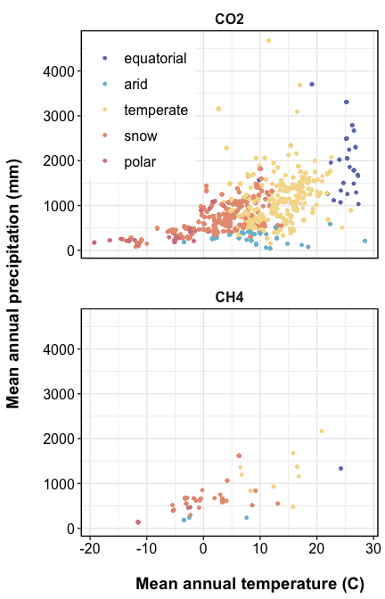
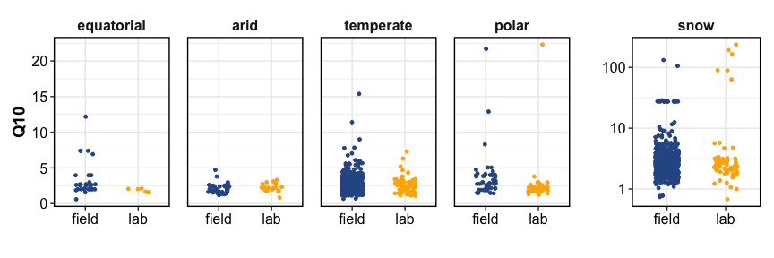
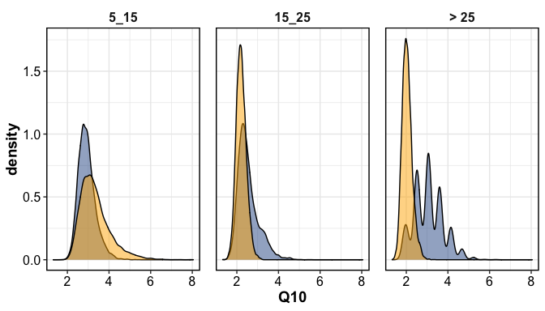
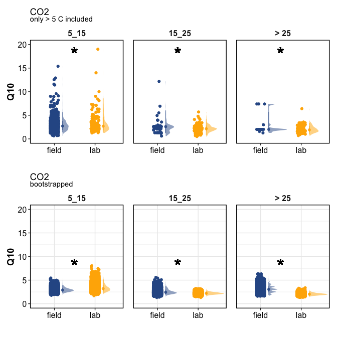
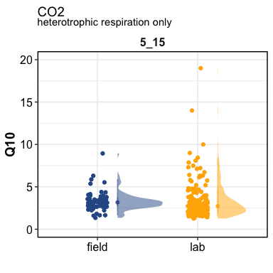
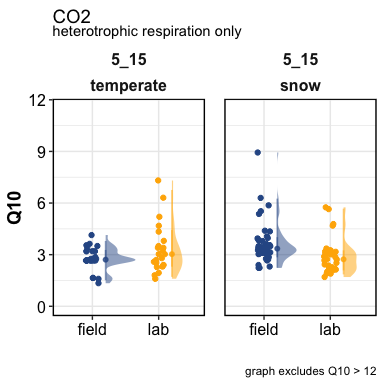

data analysis
================

------------------------------------------------------------------------

## EXPLORATION

### Study sites

<!-- -->

<!-- -->

### How many datapoints?

Datapoints:

| Species | ClimateTypes | field | lab |  NA |
|:--------|:-------------|------:|----:|----:|
| CO2     | equatorial   |    64 |  21 |  NA |
| CO2     | arid         |   165 |  36 |  NA |
| CO2     | temperate    |  1875 | 153 |  NA |
| CO2     | snow         |  2562 | 132 |  NA |
| CO2     | polar        |   120 |  89 |  NA |
| CO2     | NA           |    67 | 324 |  NA |
| CH4     | arid         |     2 |  12 |  NA |
| CH4     | temperate    |    10 |  11 |  NA |
| CH4     | snow         |    44 |  54 |   1 |
| CH4     | polar        |     2 |  13 |  NA |
| CH4     | NA           |     3 |  43 |  20 |
| CH4     | equatorial   |    NA |   1 |  NA |

Studies:

| Species | ClimateTypes | field | lab |  NA |
|:--------|:-------------|------:|----:|----:|
| CO2     | equatorial   |    19 |   6 |  NA |
| CO2     | arid         |    28 |   6 |  NA |
| CO2     | temperate    |   272 |  32 |  NA |
| CO2     | snow         |   232 |  22 |  NA |
| CO2     | polar        |    29 |  11 |  NA |
| CO2     | NA           |    11 |  47 |  NA |
| CH4     | arid         |     2 |   1 |  NA |
| CH4     | temperate    |     8 |   6 |  NA |
| CH4     | snow         |    11 |   8 |   1 |
| CH4     | polar        |     2 |   3 |  NA |
| CH4     | NA           |     5 |   6 |  10 |
| CH4     | equatorial   |    NA |   1 |  NA |

### Studies by Climate

<!-- -->

### Incubation Temperature Ranges

<!-- -->

------------------------------------------------------------------------

## Analysis - CO2

### All studies, all temperatures

We included all datapoints collected, irrespective of incubation
temperature range. (0-10 C, 0-15 C, 0-20 C, 10-20 C, 5-15 C, etc.)

<!-- -->

    #> # A tibble: 1 × 6
    #>   term          df sumsq meansq statistic    p_value
    #>   <chr>      <dbl> <dbl>  <dbl>     <dbl>      <dbl>
    #> 1 Incubation     1 1898.  1898.      32.0    1.64e-8

We then subset the data to include only incubations with temperature
ranges of 10 C. (0-10 C, 10-20 C, 5-15 C, 15-25 C, etc.)

<!-- -->

    #> # A tibble: 1 × 6
    #>   term          df sumsq meansq statistic  p_value
    #>   <chr>      <dbl> <dbl>  <dbl>     <dbl>    <dbl>
    #> 1 Incubation     1 3279.  3279.      42.2 8.98e-11

### Subsetting by temperature range

We then subset the data to include only incubations with specific
temperature ranges: &lt; 5 C, 5-15 C, 15-25 C, &gt; 25C. These ranges
were chosen because these ranges had the highest frequency of data, and
this would also avoid issues pertaining to frozen soils (if we were tp
choose 0-10 C).

<!-- -->

    #> # A tibble: 3 × 7
    #> # Groups:   Temp_range [3]
    #>   Temp_range term          df sumsq meansq statistic
    #>   <fct>      <chr>      <dbl> <dbl>  <dbl>     <dbl>
    #> 1 5_15       Incubation     1 22.3   22.3      11.1 
    #> 2 15_25      Incubation     1  4.92   4.92      4.07
    #> 3 > 25       Incubation     1 13.9   13.9      12.6 
    #> # … with 1 more variable: p_value <dbl>

### Grouping by biome

    #> $combined

<!-- -->

### Bootstrapping the data

The data were highly skewed toward the field measurements, because most
came from the highly curated SRDB. To do a more balanced analysis, we
did bootstrapping by randomly sampling 1000 times, 10 samples each.

<!-- --><!-- -->

    #> # A tibble: 3 × 7
    #> # Groups:   Temp_range [3]
    #>   Temp_range term          df sumsq meansq statistic
    #>   <fct>      <chr>      <dbl> <dbl>  <dbl>     <dbl>
    #> 1 5_15       Incubation     1  777.   777.     2302.
    #> 2 15_25      Incubation     1  521.   521.     3429.
    #> 3 > 25       Incubation     1 5304.  5304.    19667.
    #> # … with 1 more variable: p_value <dbl>

### Combining non-bootstrap and bootstrap plots

<!-- -->

### Heterotrophic respiration

The field measurements reported above included both autotrophic and
heterotrophic respiration, whereas the lab measurements refer only to
heterotrophic. We subset field measurements that were heterotrophic
respiration only, and compared that with lab.

The heterotrophic field measurements were available for temperate and
snow biomes only.

<!-- --><!-- -->

    #>              Df Sum Sq Mean Sq F value Pr(>F)
    #> Incubation    1     33   32.81   0.968  0.326
    #> Residuals   239   8100   33.89               
    #> 2 observations deleted due to missingness
    #> # A tibble: 9 × 3
    #> # Groups:   Temp_range [6]
    #>   Temp_range Incubation     n
    #>   <fct>      <chr>      <int>
    #> 1 < 0        lab            8
    #> 2 0_5        lab           13
    #> 3 5_15       field         76
    #> 4 5_15       lab          167
    #> 5 15_25      field          1
    #> 6 15_25      lab          147
    #> 7 > 25       lab          118
    #> 8 <NA>       field        201
    #> 9 <NA>       lab          442

------------------------------------------------------------------------

## Analysis - CH4

<!-- -->

    #> # A tibble: 1 × 6
    #>   term          df sumsq meansq statistic p_value
    #>   <chr>      <dbl> <dbl>  <dbl>     <dbl>   <dbl>
    #> 1 Incubation     1  14.1   14.1     0.159   0.690

------------------------------------------------------------------------

Session Info

Date run: 2022-03-11

    #> R version 4.1.1 (2021-08-10)
    #> Platform: x86_64-apple-darwin17.0 (64-bit)
    #> Running under: macOS Catalina 10.15.7
    #> 
    #> Matrix products: default
    #> BLAS:   /System/Library/Frameworks/Accelerate.framework/Versions/A/Frameworks/vecLib.framework/Versions/A/libBLAS.dylib
    #> LAPACK: /Library/Frameworks/R.framework/Versions/4.1/Resources/lib/libRlapack.dylib
    #> 
    #> locale:
    #> [1] en_US.UTF-8/en_US.UTF-8/en_US.UTF-8/C/en_US.UTF-8/en_US.UTF-8
    #> 
    #> attached base packages:
    #> [1] stats     graphics  grDevices utils    
    #> [5] datasets  methods   base     
    #> 
    #> other attached packages:
    #>  [1] patchwork_1.1.1         data.table_1.14.2      
    #>  [3] sidb_1.0.0              sf_1.0-5               
    #>  [5] rnaturalearthdata_0.1.0 rnaturalearth_0.1.0    
    #>  [7] nlme_3.1-153            drake_7.13.2           
    #>  [9] forcats_0.5.1           stringr_1.4.0          
    #> [11] dplyr_1.0.7             purrr_0.3.4            
    #> [13] readr_2.0.2             tidyr_1.1.4            
    #> [15] tibble_3.1.5            ggplot2_3.3.5          
    #> [17] tidyverse_1.3.1        
    #> 
    #> loaded via a namespace (and not attached):
    #>  [1] fs_1.5.0             lubridate_1.8.0     
    #>  [3] filelock_1.0.2       progress_1.2.2      
    #>  [5] httr_1.4.2           tools_4.1.1         
    #>  [7] backports_1.2.1      utf8_1.2.2          
    #>  [9] R6_2.5.1             KernSmooth_2.23-20  
    #> [11] rgeos_0.5-9          DBI_1.1.1           
    #> [13] colorspace_2.0-2     ggdist_3.1.1        
    #> [15] withr_2.4.2          sp_1.4-5            
    #> [17] tidyselect_1.1.1     prettyunits_1.1.1   
    #> [19] FME_1.3.6.1          compiler_4.1.1      
    #> [21] cli_3.0.1            rvest_1.0.1         
    #> [23] xml2_1.3.2           labeling_0.4.2      
    #> [25] scales_1.1.1         classInt_0.4-3      
    #> [27] proxy_0.4-26         digest_0.6.27       
    #> [29] minqa_1.2.4          txtq_0.2.4          
    #> [31] rmarkdown_2.11       pkgconfig_2.0.3     
    #> [33] htmltools_0.5.2      highr_0.9           
    #> [35] dbplyr_2.1.1         fastmap_1.1.0       
    #> [37] rlang_0.4.11         readxl_1.3.1        
    #> [39] rstudioapi_0.13      farver_2.1.0        
    #> [41] generics_0.1.0       jsonlite_1.7.2      
    #> [43] distributional_0.3.0 magrittr_2.0.1      
    #> [45] s2_1.0.7             Rcpp_1.0.8          
    #> [47] munsell_0.5.0        fansi_0.5.0         
    #> [49] lifecycle_1.0.0      stringi_1.7.5       
    #> [51] yaml_2.2.1           MASS_7.3-54         
    #> [53] rootSolve_1.8.2.2    storr_1.2.5         
    #> [55] grid_4.1.1           parallel_4.1.1      
    #> [57] crayon_1.4.1         lattice_0.20-44     
    #> [59] haven_2.4.3          hms_1.1.0           
    #> [61] knitr_1.36           pillar_1.6.2        
    #> [63] igraph_1.2.6         PNWColors_0.1.0     
    #> [65] base64url_1.4        soilpalettes_0.1.0  
    #> [67] wk_0.6.0             reprex_2.0.1        
    #> [69] glue_1.4.2           evaluate_0.14       
    #> [71] modelr_0.1.8         deSolve_1.28        
    #> [73] vctrs_0.3.8          tzdb_0.1.2          
    #> [75] cellranger_1.1.0     gtable_0.3.0        
    #> [77] assertthat_0.2.1     xfun_0.25           
    #> [79] broom_0.7.10         e1071_1.7-8         
    #> [81] coda_0.19-4          class_7.3-19        
    #> [83] minpack.lm_1.2-1     tinytex_0.33        
    #> [85] units_0.7-2          ellipsis_0.3.2

