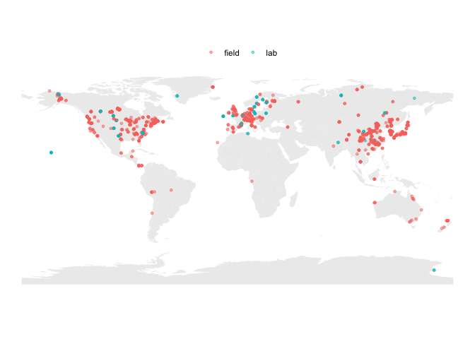
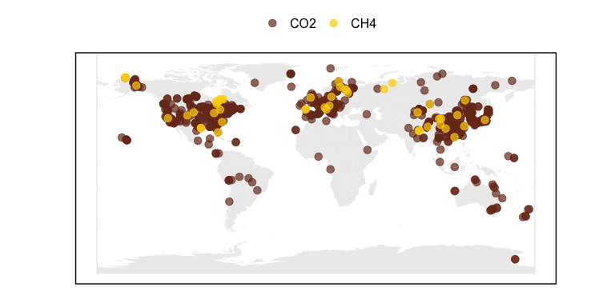
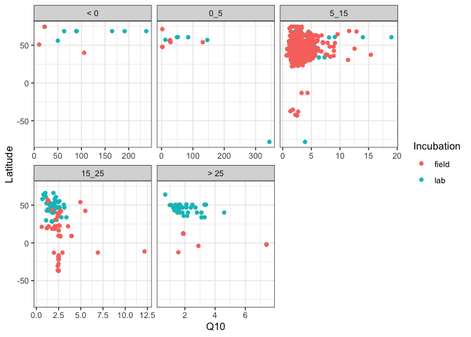

data analysis
================

## Respiration Q10

### Study sites included

<!-- -->

### Field vs. lab

-   field vs. lab was significantly different (ANOVA) for:
    -   5-15 °C (lab &gt; field)

    -   15-25 °C (field &gt; lab)

    -   25 °C (field &gt; lab)

<!-- -->

    #> $resp_q10_temp

<!-- -->

    #> 
    #> $resp_q10_latitude

<!-- -->

------------------------------------------------------------------------

Session Info

Date run: 2021-04-15

    #> R version 4.0.2 (2020-06-22)
    #> Platform: x86_64-apple-darwin17.0 (64-bit)
    #> Running under: macOS Catalina 10.15.7
    #> 
    #> Matrix products: default
    #> BLAS:   /System/Library/Frameworks/Accelerate.framework/Versions/A/Frameworks/vecLib.framework/Versions/A/libBLAS.dylib
    #> LAPACK: /Library/Frameworks/R.framework/Versions/4.0/Resources/lib/libRlapack.dylib
    #> 
    #> locale:
    #> [1] en_US.UTF-8/en_US.UTF-8/en_US.UTF-8/C/en_US.UTF-8/en_US.UTF-8
    #> 
    #> attached base packages:
    #> [1] stats     graphics  grDevices utils     datasets  methods   base     
    #> 
    #> other attached packages:
    #>  [1] data.table_1.13.6       sidb_1.0.0              sf_0.9-8               
    #>  [4] rnaturalearthdata_0.1.0 rnaturalearth_0.1.0     nlme_3.1-152           
    #>  [7] drake_7.13.1            forcats_0.5.1           stringr_1.4.0          
    #> [10] dplyr_1.0.4             purrr_0.3.4             readr_1.4.0            
    #> [13] tidyr_1.1.2             tibble_3.0.6            ggplot2_3.3.3          
    #> [16] tidyverse_1.3.0        
    #> 
    #> loaded via a namespace (and not attached):
    #>  [1] httr_1.4.2         jsonlite_1.7.2     modelr_0.1.8       assertthat_0.2.1  
    #>  [5] measurements_1.4.0 highr_0.8          sp_1.4-5           base64url_1.4     
    #>  [9] cellranger_1.1.0   yaml_2.2.1         progress_1.2.2     pillar_1.4.7      
    #> [13] backports_1.2.1    lattice_0.20-41    glue_1.4.2         digest_0.6.27     
    #> [17] rvest_0.3.6        minqa_1.2.4        colorspace_2.0-0   htmltools_0.5.1.1 
    #> [21] pkgconfig_2.0.3    FME_1.3.6.1        broom_0.7.4        haven_2.3.1       
    #> [25] scales_1.1.1       rootSolve_1.8.2.1  txtq_0.2.3         farver_2.0.3      
    #> [29] generics_0.1.0     ellipsis_0.3.1     withr_2.4.1        cli_2.2.0         
    #> [33] magrittr_2.0.1     crayon_1.4.0       readxl_1.3.1       evaluate_0.14     
    #> [37] storr_1.2.5        fs_1.5.0           fansi_0.4.2        MASS_7.3-53       
    #> [41] xml2_1.3.2         class_7.3-18       tools_4.0.2        prettyunits_1.1.1 
    #> [45] hms_1.0.0          minpack.lm_1.2-1   lifecycle_0.2.0    munsell_0.5.0     
    #> [49] reprex_1.0.0       compiler_4.0.2     e1071_1.7-4        rlang_0.4.10      
    #> [53] classInt_0.4-3     units_0.7-1        grid_4.0.2         rstudioapi_0.13   
    #> [57] igraph_1.2.6       labeling_0.4.2     rmarkdown_2.6.6    gtable_0.3.0      
    #> [61] deSolve_1.28       DBI_1.1.1          R6_2.5.0           lubridate_1.7.9.2 
    #> [65] knitr_1.31         rgeos_0.5-5        filelock_1.0.2     KernSmooth_2.23-18
    #> [69] stringi_1.5.3      parallel_4.0.2     Rcpp_1.0.6         vctrs_0.3.6       
    #> [73] dbplyr_2.0.0       tidyselect_1.1.0   xfun_0.20          coda_0.19-4

