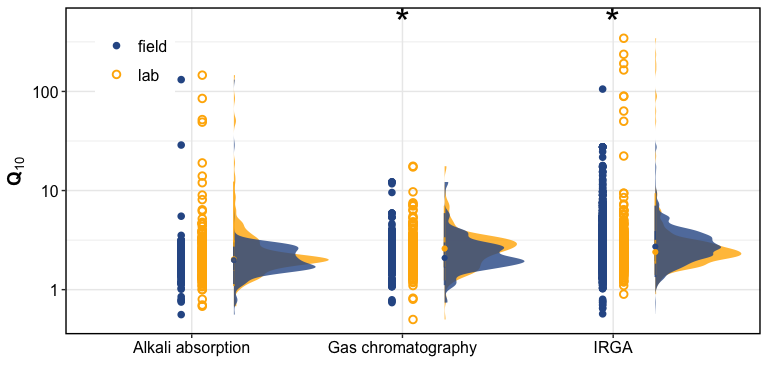

data analysis
================

------------------------------------------------------------------------

## Study sites

<!-- -->

How many datapoints?

| Species | field | lab |  NA |
|:--------|------:|----:|----:|
| CH4     |    67 | 136 |  21 |
| CO2     |  4973 | 799 |   1 |
| N2O     |    52 |  98 |   3 |
| NA      |    NA |  44 |  NA |

How many studies?

| Species | field | lab |  NA |
|:--------|------:|----:|----:|
| CH4     |    33 |  23 |  11 |
| CO2     |   600 |  86 |   1 |
| N2O     |    22 |  23 |   2 |
| NA      |    NA |  16 |  NA |

------------------------------------------------------------------------

## Field vs. lab

### Stats

CO2 - by temperature

    #> # A tibble: 3 × 7
    #> # Groups:   Temp_range [3]
    #>   Temp_range term          df sumsq meansq statistic  p_value
    #>   <fct>      <chr>      <dbl> <dbl>  <dbl>     <dbl>    <dbl>
    #> 1 5_15       Incubation     1 20.6   20.6      10.4  0.00129 
    #> 2 15_25      Incubation     1  7.81   7.81      6.33 0.0128  
    #> 3 > 25       Incubation     1 18.8   18.8      14.3  0.000229

paired (field AND lab) results were not available for &lt; 0 C and 0-5
C.

CO2 - across all temperatures

-   ANOVA

<!-- -->

    #> # A tibble: 1 × 6
    #>   term          df sumsq meansq statistic  p_value
    #>   <chr>      <dbl> <dbl>  <dbl>     <dbl>    <dbl>
    #> 1 Incubation     1 1683.  1683.      14.9 0.000116

-   LME

<!-- -->

    #>             numDF denDF  F-value p-value
    #> (Intercept)     1  1827 2.203403  0.1379
    #> Incubation      1  1827 5.436477  0.0198

N2O - across all temperatures

    #> # A tibble: 1 × 6
    #>   term          df sumsq meansq statistic p_value
    #>   <chr>      <dbl> <dbl>  <dbl>     <dbl>   <dbl>
    #> 1 Incubation     1  246.   246.      1.52   0.219

CH4 - across all temperatures

    #> # A tibble: 1 × 6
    #>   term          df sumsq meansq statistic p_value
    #>   <chr>      <dbl> <dbl>  <dbl>     <dbl>   <dbl>
    #> 1 Incubation     1 0.505  0.505   0.00563   0.940

### Graphs

    #> $resp_q10_temp

<!-- -->

    #> 
    #> $resp_q10_temp_jitter

<!-- -->

    #> 
    #> $resp_q10_latitude

<!-- -->

    #> 
    #> $resp_biome

<!-- -->

    #> 
    #> $resp_ecosystem

<!-- -->

    #> 
    #> $N2O_incubation

<!-- -->

    #> 
    #> $CH4_incubation

<!-- -->

### Respiration: autotrophic/heterotrophic

Most field studies include auto + heterotrophic respiration

Some SRDB studies (field) were heterotrophic only

    #> # A tibble: 9 × 3
    #> # Groups:   Temp_range [6]
    #>   Temp_range Incubation     n
    #>   <fct>      <chr>      <int>
    #> 1 < 0        lab            8
    #> 2 0_5        lab           10
    #> 3 5_15       field         76
    #> 4 5_15       lab          155
    #> 5 15_25      field          1
    #> 6 15_25      lab          150
    #> 7 > 25       lab          175
    #> 8 <NA>       field        201
    #> 9 <NA>       lab          589

<!-- -->

running ANOVA on 5-15 C heterotrophic respiration only

    #>              Df Sum Sq Mean Sq F value Pr(>F)  
    #> Incubation    1    180  180.24   2.736 0.0995 .
    #> Residuals   229  15085   65.87                 
    #> ---
    #> Signif. codes:  0 '***' 0.001 '**' 0.01 '*' 0.05 '.' 0.1 ' ' 1

## Fitting Q10 functions

Click to open table

| citationKey      | temp\_range\_min | temp\_range\_max |   n | fun          | form                                             |       a |       b |       c | err | gof\_cor | gof\_rmse | gof\_rsquared |      R10 | adj\_rsquared | notes  | Q10\_5\_15 | Q10\_15\_25 | Q10\_25\_35 | Q10\_35\_45 |
|:-----------------|-----------------:|-----------------:|----:|:-------------|:-------------------------------------------------|--------:|--------:|--------:|:----|---------:|----------:|--------------:|---------:|--------------:|:-------|-----------:|------------:|------------:|------------:|
| Andrews2000SBB   |              4.0 |             40.0 |  18 | quadratic    | Rs = a + b*T + c*(T^2)                           |   0.134 |   0.401 |  -0.013 | NA  |    0.653 |     0.000 |         1.000 |    2.846 |            NA | NA     |   2.777410 |   1.6298822 |   0.1304134 |   5.6230900 |
| Andrews2000SBB   |              4.0 |             40.0 |  18 | exponential  | Rs = a \* exp(b \* T)                            |   0.040 |   0.046 |      NA | NA  |    0.632 |     0.015 |         0.990 |    0.063 |            NA | NA     |   2.600000 |   2.5750000 |   2.5952381 |   2.5920398 |
| Andrews2000SBB   |              4.0 |             40.0 |  18 | Lloyd-Taylor | Rs = R10 \* exp(308.56 \* ((1/56) - (1/(T+46)))) |      NA |      NA |      NA | NA  |    0.638 |     0.000 |         1.000 |    0.035 |         0.370 | NA     |   3.619048 |   3.0545455 |   2.7079646 |   2.5181347 |
| Andrews2000SBB   |              4.0 |             40.0 |  18 | arrhenius    | Rs = a \* exp(-b / (8.314 \* T))                 |   0.501 | 235.305 |      NA | NA  |    0.653 |     0.021 |         0.979 |    0.030 |            NA | b = Ea |  39.000000 |   3.1315789 |   2.3765432 |   2.1973094 |
| Arevalo2012      |              7.0 |             21.0 | 195 | quadratic    | Rs = a + b*T + c*(T^2)                           |  20.984 | 106.370 |   1.631 | NA  |    0.622 |     0.000 |         1.000 | 1247.731 |            NA | NA     |   4.341328 |   2.8651341 |   2.5519983 |          NA |
| Arevalo2012      |              7.0 |             21.0 | 195 | exponential  | Rs = a \* exp(b \* T)                            |   8.078 |   0.064 |      NA | NA  |    0.618 |     0.528 |         0.998 |   15.268 |            NA | NA     |   2.890140 |   2.8901382 |   2.8901044 |          NA |
| Arevalo2012      |              7.0 |             21.0 | 195 | Lloyd-Taylor | Rs = R10 \* exp(308.56 \* ((1/56) - (1/(T+46)))) |      NA |      NA |      NA | NA  |    0.619 |     0.000 |         1.000 |   10.630 |         0.380 | NA     |   3.695996 |   3.0389844 |   2.7100943 |          NA |
| Arevalo2012      |              7.0 |             21.0 | 195 | arrhenius    | Rs = a \* exp(-b / (8.314 \* T))                 |  48.382 |  87.783 |      NA | NA  |    0.611 |     1.036 |         0.993 |   16.832 |            NA | b = Ea |   5.086749 |   2.3252131 |   2.1282359 |          NA |
| Barrett2006      |              5.0 |             20.0 | 297 | quadratic    | Rs = a + b*T + c*(T^2)                           |   0.240 |   1.441 |  -0.070 | NA  |    0.261 |     0.000 |         1.000 |    7.679 |            NA | NA     |   2.081901 |  -0.1851191 |   5.7511968 |          NA |
| Barrett2006      |              5.0 |             20.0 | 297 | exponential  | Rs = a \* exp(b \* T)                            |   0.114 |   0.053 |      NA | NA  |    0.259 |     0.004 |         1.000 |    0.193 |            NA | NA     |   2.702703 |   2.7023810 |   2.7016317 |          NA |
| Barrett2006      |              5.0 |             20.0 | 297 | Lloyd-Taylor | Rs = R10 \* exp(308.56 \* ((1/56) - (1/(T+46)))) |      NA |      NA |      NA | NA  |    0.259 |     0.000 |         1.000 |    0.106 |         0.064 | NA     |   3.677419 |   3.0361446 |   2.7100592 |          NA |
| Barrett2006      |              5.0 |             20.0 | 297 | arrhenius    | Rs = a \* exp(-b / (8.314 \* T))                 |   0.438 |  51.469 |      NA | NA  |    0.258 |     0.010 |         0.999 |    0.236 |            NA | b = Ea |   3.283465 |   2.1793103 |   2.0730994 |          NA |
| BradleyCook2016  |              4.5 |             24.5 | 200 | quadratic    | Rs = a + b*T + c*(T^2)                           |  11.734 |  86.044 |   3.512 | NA  |    0.294 |     0.000 |         1.000 | 1223.423 |            NA | NA     |   4.950229 |   3.0825350 |   2.6810067 |          NA |
| BradleyCook2016  |              4.5 |             24.5 | 200 | exponential  | Rs = a \* exp(b \* T)                            |   4.213 |   0.068 |      NA | NA  |    0.290 |     1.219 |         0.997 |    8.316 |            NA | NA     |   2.973813 |   2.9737225 |   2.9736762 |          NA |
| BradleyCook2016  |              4.5 |             24.5 | 200 | Lloyd-Taylor | Rs = R10 \* exp(308.56 \* ((1/56) - (1/(T+46)))) |      NA |      NA |      NA | NA  |    0.292 |     0.000 |         1.000 |    6.733 |         0.081 | NA     |   3.696151 |   3.0388579 |   2.7100858 |          NA |
| BradleyCook2016  |              4.5 |             24.5 | 200 | arrhenius    | Rs = a \* exp(-b / (8.314 \* T))                 |  35.496 | 114.466 |      NA | NA  |    0.287 |     4.640 |         0.950 |    8.959 |            NA | b = Ea |   7.269792 |   2.4436371 |   2.1703885 |          NA |
| Conant2008       |              4.0 |             25.0 |  45 | quadratic    | Rs = a + b*T + c*(T^2)                           |  53.773 | 215.865 |   7.792 | NA  |    0.688 |     0.000 |         1.000 | 2991.600 |            NA | NA     |   4.799168 |   3.0456799 |   2.6621638 |          NA |
| Conant2008       |              4.0 |             25.0 |  45 | exponential  | Rs = a \* exp(b \* T)                            |  16.122 |   0.071 |      NA | NA  |    0.678 |     4.401 |         0.991 |   32.790 |            NA | NA     |   3.033881 |   3.0338515 |   3.0338769 |          NA |
| Conant2008       |              4.0 |             25.0 |  45 | Lloyd-Taylor | Rs = R10 \* exp(308.56 \* ((1/56) - (1/(T+46)))) |      NA |      NA |      NA | NA  |    0.684 |     0.000 |         1.000 |   28.941 |         0.455 | NA     |   3.696181 |   3.0389987 |   2.7100616 |          NA |
| Conant2008       |              4.0 |             25.0 |  45 | arrhenius    | Rs = a \* exp(-b / (8.314 \* T))                 | 183.420 | 145.099 |      NA | NA  |    0.681 |    23.315 |         0.752 |   32.026 |            NA | b = Ea |  11.246602 |   2.5926456 |   2.2207392 |          NA |
| Crow2019b        |             16.0 |             26.0 |  NA | NA           | NA                                               |      NA |      NA |      NA | NA  |       NA |        NA |            NA |       NA |            NA | NA     |         NA |          NA |          NA |          NA |
| Gillabel2010     |             25.0 |             35.0 |  52 | exponential  | Rs = a \* exp(b \* T)                            |   8.912 |   0.030 |      NA | NA  |    0.199 |     0.000 |         1.000 |   12.028 |            NA | NA     |         NA |          NA |   2.3495599 |          NA |
| Gillabel2010     |             25.0 |             35.0 |  52 | Lloyd-Taylor | Rs = R10 \* exp(308.56 \* ((1/56) - (1/(T+46)))) |      NA |      NA |      NA | NA  |    0.199 |     0.000 |         1.000 |    2.899 |         0.020 | NA     |         NA |          NA |   2.7100388 |          NA |
| Gillabel2010     |             25.0 |             35.0 |  52 | arrhenius    | Rs = a \* exp(-b / (8.314 \* T))                 |  53.850 | 218.093 |      NA | NA  |    0.199 |     0.000 |         1.000 |    3.908 |            NA | b = Ea |         NA |          NA |   2.3495599 |          NA |
| Haddix2011       |             15.0 |             35.0 | 318 | quadratic    | Rs = a + b*T + c*(T^2)                           |   9.248 |  72.333 |   6.548 | NA  |    0.291 |     0.000 |         1.000 | 1387.343 |            NA | NA     |         NA |   3.3018261 |   2.7871465 |          NA |
| Haddix2011       |             15.0 |             35.0 | 318 | exponential  | Rs = a \* exp(b \* T)                            |   2.221 |   0.054 |      NA | NA  |    0.290 |     0.251 |         1.000 |    3.803 |            NA | NA     |         NA |   2.7124196 |   2.7123577 |          NA |
| Haddix2011       |             15.0 |             35.0 | 318 | Lloyd-Taylor | Rs = R10 \* exp(308.56 \* ((1/56) - (1/(T+46)))) |      NA |      NA |      NA | NA  |    0.291 |     0.000 |         1.000 |    2.498 |         0.082 | NA     |         NA |   3.0392557 |   2.7100000 |          NA |
| Haddix2011       |             15.0 |             35.0 | 318 | arrhenius    | Rs = a \* exp(-b / (8.314 \* T))                 |  34.979 | 264.735 |      NA | NA  |    0.287 |     0.974 |         0.995 |    1.449 |            NA | b = Ea |         NA |   3.3374731 |   2.4389496 |          NA |
| Karhu2010        |              5.0 |             26.0 |  39 | quadratic    | Rs = a + b*T + c*(T^2)                           |  14.874 |  26.387 |  -5.004 | NA  |    0.305 |     0.000 |         1.000 | -221.698 |            NA | NA     | -31.966817 |   4.4295484 |   3.1164049 |          NA |
| Karhu2010        |              5.0 |             26.0 |  39 | exponential  | Rs = a \* exp(b \* T)                            |   4.503 |   0.051 |      NA | NA  |    0.292 |     0.275 |         1.000 |    7.505 |            NA | NA     |   2.666781 |   2.6666323 |   2.6667080 |          NA |
| Karhu2010        |              5.0 |             26.0 |  39 | Lloyd-Taylor | Rs = R10 \* exp(308.56 \* ((1/56) - (1/(T+46)))) |      NA |      NA |      NA | NA  |    0.293 |     0.000 |         1.000 |    4.141 |         0.061 | NA     |   3.696229 |   3.0388872 |   2.7100641 |          NA |
| Karhu2010        |              5.0 |             26.0 |  39 | arrhenius    | Rs = a \* exp(-b / (8.314 \* T))                 |  25.281 |  87.271 |      NA | NA  |    0.304 |     0.077 |         1.000 |    8.849 |            NA | b = Ea |   5.053260 |   2.3230071 |   2.1274303 |          NA |
| Lavoie2011JGR    |              5.0 |             15.0 | 532 | exponential  | Rs = a \* exp(b \* T)                            |   2.707 |   0.094 |      NA | NA  |    0.197 |     0.000 |         1.000 |    6.951 |            NA | NA     |   3.568004 |   3.5679533 |   3.5679729 |          NA |
| Lavoie2011JGR    |              5.0 |             15.0 | 532 | Lloyd-Taylor | Rs = R10 \* exp(308.56 \* ((1/56) - (1/(T+46)))) |      NA |      NA |      NA | NA  |    0.197 |     0.000 |         1.000 |    6.883 |         0.037 | NA     |   3.696259 |   3.0389382 |   2.7100930 |          NA |
| Lavoie2011JGR    |              5.0 |             15.0 | 532 | arrhenius    | Rs = a \* exp(-b / (8.314 \* T))                 |  17.851 |  58.809 |      NA | NA  |    0.197 |     0.000 |         1.000 |    8.800 |            NA | b = Ea |   3.568004 |   2.2075404 |   2.0842254 |          NA |
| NeffHooper2002   |             10.0 |             30.0 | 130 | exponential  | Rs = a \* exp(b \* T)                            |   0.528 |   0.016 |      NA | NA  |    0.190 |     0.000 |         1.000 |    0.618 |            NA | NA     |   2.169580 |   2.1718984 |   2.1709184 |          NA |
| NeffHooper2002   |             10.0 |             30.0 | 130 | Lloyd-Taylor | Rs = R10 \* exp(308.56 \* ((1/56) - (1/(T+46)))) |      NA |      NA |      NA | NA  |    0.190 |     0.000 |         1.000 |    0.070 |         0.029 | NA     |   3.682927 |   3.0454545 |   2.7111111 |          NA |
| NeffHooper2002   |             10.0 |             30.0 | 130 | arrhenius    | Rs = a \* exp(-b / (8.314 \* T))                 |   0.993 |  39.356 |      NA | NA  |    0.190 |     0.000 |         1.000 |    0.619 |            NA | b = Ea |   2.880520 |   2.1353591 |   2.0547445 |          NA |
| Niklinska1999    |              5.0 |             25.0 | 245 | quadratic    | Rs = a + b*T + c*(T^2)                           |  32.437 | 199.578 | -19.549 | NA  |    0.588 |     0.000 |         1.000 |   73.279 |            NA | NA     |  -1.534200 |   6.2433201 |   3.3525851 |          NA |
| Niklinska1999    |              5.0 |             25.0 | 245 | exponential  | Rs = a \* exp(b \* T)                            |  13.891 |   0.052 |      NA | NA  |    0.569 |     2.933 |         0.982 |   23.461 |            NA | NA     |   2.689010 |   2.6889472 |   2.6889273 |          NA |
| Niklinska1999    |              5.0 |             25.0 | 245 | Lloyd-Taylor | Rs = R10 \* exp(308.56 \* ((1/56) - (1/(T+46)))) |      NA |      NA |      NA | NA  |    0.570 |     0.000 |         1.000 |   13.296 |         0.323 | NA     |   3.696140 |   3.0389237 |   2.7100758 |          NA |
| Niklinska1999    |              5.0 |             25.0 | 245 | arrhenius    | Rs = a \* exp(-b / (8.314 \* T))                 |  69.916 |  82.933 |      NA | NA  |    0.578 |     4.894 |         0.950 |   25.785 |            NA | b = Ea |   4.781260 |   2.3047336 |   2.1207554 |          NA |
| Reichstein2000   |              5.0 |             25.0 | 102 | quadratic    | Rs = a + b*T + c*(T^2)                           |   3.601 |  19.468 |   4.064 | NA  |    0.334 |     0.000 |         1.000 |  604.646 |            NA | NA     |   6.974034 |   3.5043147 |   2.8689082 |          NA |
| Reichstein2000   |              5.0 |             25.0 | 102 | exponential  | Rs = a \* exp(b \* T)                            |   1.049 |   0.071 |      NA | NA  |    0.334 |     0.023 |         1.000 |    2.141 |            NA | NA     |   3.040027 |   3.0405494 |   3.0407051 |          NA |
| Reichstein2000   |              5.0 |             25.0 | 102 | Lloyd-Taylor | Rs = R10 \* exp(308.56 \* ((1/56) - (1/(T+46)))) |      NA |      NA |      NA | NA  |    0.333 |     0.000 |         1.000 |    1.819 |         0.102 | NA     |   3.695283 |   3.0388519 |   2.7102146 |          NA |
| Reichstein2000   |              5.0 |             25.0 | 102 | arrhenius    | Rs = a \* exp(-b / (8.314 \* T))                 |  11.328 | 137.276 |      NA | NA  |    0.315 |     2.583 |         0.808 |    2.173 |            NA | b = Ea |  10.035971 |   2.5530786 |   2.2077922 |          NA |
| Sierra2017BG     |             25.0 |             35.0 | 288 | exponential  | Rs = a \* exp(b \* T)                            |  10.175 |   0.029 |      NA | NA  |    0.258 |     0.000 |         1.000 |   13.576 |            NA | NA     |         NA |          NA |   2.3341937 |          NA |
| Sierra2017BG     |             25.0 |             35.0 | 288 | Lloyd-Taylor | Rs = R10 \* exp(308.56 \* ((1/56) - (1/(T+46)))) |      NA |      NA |      NA | NA  |    0.258 |     0.000 |         1.000 |    3.074 |         0.063 | NA     |         NA |          NA |   2.7100640 |          NA |
| Sierra2017BG     |             25.0 |             35.0 | 288 | arrhenius    | Rs = a \* exp(-b / (8.314 \* T))                 |  57.395 | 209.753 |      NA | NA  |    0.258 |     0.000 |         1.000 |    4.605 |            NA | b = Ea |         NA |          NA |   2.3341937 |          NA |
| Song2010         |              5.0 |             25.0 | 105 | quadratic    | Rs = a + b*T + c*(T^2)                           |   3.677 |   5.864 |   0.393 | NA  |    0.136 |     0.000 |         1.000 |  101.649 |            NA | NA     |   5.205912 |   3.1989508 |   2.7438375 |          NA |
| Song2010         |              5.0 |             25.0 | 105 | exponential  | Rs = a \* exp(b \* T)                            |   2.723 |   0.019 |      NA | NA  |    0.136 |     0.001 |         1.000 |    3.299 |            NA | NA     |   2.211879 |   2.2117291 |   2.2117701 |          NA |
| Song2010         |              5.0 |             25.0 | 105 | Lloyd-Taylor | Rs = R10 \* exp(308.56 \* ((1/56) - (1/(T+46)))) |      NA |      NA |      NA | NA  |    0.135 |     0.000 |         1.000 |    0.529 |         0.009 | NA     |   3.701299 |   3.0384615 |   2.7099057 |          NA |
| Song2010         |              5.0 |             25.0 | 105 | arrhenius    | Rs = a \* exp(-b / (8.314 \* T))                 |   4.545 |  18.181 |      NA | NA  |    0.124 |     0.010 |         1.000 |    3.652 |            NA | b = Ea |   2.338331 |   2.0600815 |   2.0254563 |          NA |
| Townsend1997     |             20.0 |             40.0 |  90 | quadratic    | Rs = a + b*T + c*(T^2)                           | 117.641 | 337.825 |  -8.502 | NA  |    0.335 |     0.000 |         1.000 | 2645.736 |            NA | NA     |         NA |   1.9931657 |   1.4699161 |  -0.2414349 |
| Townsend1997     |             20.0 |             40.0 |  90 | exponential  | Rs = a \* exp(b \* T)                            |  37.306 |   0.037 |      NA | NA  |    0.333 |     1.363 |         1.000 |   53.919 |            NA | NA     |         NA |   2.4453118 |   2.4453185 |   2.4453175 |
| Townsend1997     |             20.0 |             40.0 |  90 | Lloyd-Taylor | Rs = R10 \* exp(308.56 \* ((1/56) - (1/(T+46)))) |      NA |      NA |      NA | NA  |    0.334 |     0.000 |         1.000 |   19.097 |         0.101 | NA     |         NA |   3.0389333 |   2.7100772 |   2.5198562 |
| Townsend1997     |             20.0 |             40.0 |  90 | arrhenius    | Rs = a \* exp(-b / (8.314 \* T))                 | 353.034 | 265.129 |      NA | NA  |    0.335 |     0.751 |         1.000 |   14.550 |            NA | b = Ea |         NA |   3.3405740 |   2.4397213 |   2.2244250 |
| Wang2010         |              5.0 |             20.0 | 280 | quadratic    | Rs = a + b*T + c*(T^2)                           |   2.049 |  11.909 |   0.351 | NA  |    0.433 |     0.000 |         1.000 |  156.223 |            NA | NA     |   4.689566 |   2.9992104 |   2.6349745 |          NA |
| Wang2010         |              5.0 |             20.0 | 280 | exponential  | Rs = a \* exp(b \* T)                            |   0.892 |   0.062 |      NA | NA  |    0.431 |     0.055 |         0.999 |    1.657 |            NA | NA     |   2.857730 |   2.8579017 |   2.8577555 |          NA |
| Wang2010         |              5.0 |             20.0 | 280 | Lloyd-Taylor | Rs = R10 \* exp(308.56 \* ((1/56) - (1/(T+46)))) |      NA |      NA |      NA | NA  |    0.431 |     0.000 |         1.000 |    1.097 |         0.183 | NA     |   3.697966 |   3.0382831 |   2.7103017 |          NA |
| Wang2010         |              5.0 |             20.0 | 280 | arrhenius    | Rs = a \* exp(-b / (8.314 \* T))                 |   4.087 |  62.087 |      NA | NA  |    0.418 |     0.187 |         0.987 |    1.937 |            NA | b = Ea |   3.705882 |   2.2202093 |   2.0890795 |          NA |
| WicklandNeff2008 |             10.0 |             20.0 | 272 | exponential  | Rs = a \* exp(b \* T)                            |   0.608 |   0.040 |      NA | NA  |    0.239 |     0.000 |         1.000 |    0.909 |            NA | NA     |   2.496635 |   2.4955036 |   2.4960914 |          NA |
| WicklandNeff2008 |             10.0 |             20.0 | 272 | Lloyd-Taylor | Rs = R10 \* exp(308.56 \* ((1/56) - (1/(T+46)))) |      NA |      NA |      NA | NA  |    0.239 |     0.000 |         1.000 |    0.346 |         0.054 | NA     |   3.701493 |   3.0386740 |   2.7100271 |          NA |
| WicklandNeff2008 |             10.0 |             20.0 | 272 | arrhenius    | Rs = a \* exp(-b / (8.314 \* T))                 |   2.035 |  66.973 |      NA | NA  |    0.239 |     0.000 |         1.000 |    0.909 |            NA | b = Ea |   3.928571 |   2.2396972 |   2.0963365 |          NA |
| Winkler1996      |              4.0 |             38.0 | 108 | quadratic    | Rs = a + b*T + c*(T^2)                           |   0.204 |   0.670 |   0.191 | NA  |    0.334 |     0.000 |         1.000 |   25.995 |            NA | NA     |   7.390944 |   3.5611998 |   2.8897743 |   2.6191127 |
| Winkler1996      |              4.0 |             38.0 | 108 | exponential  | Rs = a \* exp(b \* T)                            |   0.117 |   0.027 |      NA | NA  |    0.331 |     0.004 |         1.000 |    0.153 |            NA | NA     |   2.313433 |   2.3068182 |   2.3130435 |   2.3112583 |
| Winkler1996      |              4.0 |             38.0 | 108 | Lloyd-Taylor | Rs = R10 \* exp(308.56 \* ((1/56) - (1/(T+46)))) |      NA |      NA |      NA | NA  |    0.334 |     0.000 |         1.000 |    0.033 |         0.103 | NA     |   3.789474 |   3.0188679 |   2.7102804 |   2.5191257 |
| Winkler1996      |              4.0 |             38.0 | 108 | arrhenius    | Rs = a \* exp(-b / (8.314 \* T))                 |   0.270 |  26.679 |      NA | NA  |    0.226 |     0.009 |         0.998 |    0.196 |            NA | b = Ea |   2.535211 |   2.0871560 |   2.0379747 |   2.0203252 |
| Zhang2007        |             20.0 |             25.0 | 438 | exponential  | Rs = a \* exp(b \* T)                            |   0.178 |   0.000 |      NA | NA  |    0.000 |     0.000 |         1.000 |    0.178 |            NA | NA     |         NA |   2.0000000 |   2.0000000 |          NA |
| Zhang2007        |             20.0 |             25.0 | 438 | Lloyd-Taylor | Rs = R10 \* exp(308.56 \* ((1/56) - (1/(T+46)))) |      NA |      NA |      NA | NA  |       NA |     0.000 |         1.000 |    0.000 |        -0.002 | NA     |         NA |         NaN |         NaN |          NA |
| Zhang2007        |             20.0 |             25.0 | 438 | arrhenius    | Rs = a \* exp(-b / (8.314 \* T))                 |   0.178 |  -0.001 |      NA | NA  |    0.000 |     0.000 |         1.000 |    0.178 |            NA | b = Ea |         NA |   2.0000000 |   2.0000000 |          NA |

    #> $q10_calculated_functions

<!-- -->

    #> 
    #> $calculated_q10_graph

<!-- -->

------------------------------------------------------------------------

Session Info

Date run: 2022-02-08

    #> R version 4.1.1 (2021-08-10)
    #> Platform: x86_64-apple-darwin17.0 (64-bit)
    #> Running under: macOS Catalina 10.15.7
    #> 
    #> Matrix products: default
    #> BLAS:   /System/Library/Frameworks/Accelerate.framework/Versions/A/Frameworks/vecLib.framework/Versions/A/libBLAS.dylib
    #> LAPACK: /Library/Frameworks/R.framework/Versions/4.1/Resources/lib/libRlapack.dylib
    #> 
    #> locale:
    #> [1] en_US.UTF-8/en_US.UTF-8/en_US.UTF-8/C/en_US.UTF-8/en_US.UTF-8
    #> 
    #> attached base packages:
    #> [1] stats     graphics  grDevices utils     datasets  methods   base     
    #> 
    #> other attached packages:
    #>  [1] magrittr_2.0.1          googlesheets4_1.0.0     data.table_1.14.2      
    #>  [4] sidb_1.0.0              sf_1.0-5                rnaturalearthdata_0.1.0
    #>  [7] rnaturalearth_0.1.0     nlme_3.1-153            drake_7.13.2           
    #> [10] forcats_0.5.1           stringr_1.4.0           dplyr_1.0.7            
    #> [13] purrr_0.3.4             readr_2.0.2             tidyr_1.1.4            
    #> [16] tibble_3.1.5            ggplot2_3.3.5           tidyverse_1.3.1        
    #> 
    #> loaded via a namespace (and not attached):
    #>  [1] fs_1.5.0           lubridate_1.8.0    filelock_1.0.2     progress_1.2.2    
    #>  [5] httr_1.4.2         tools_4.1.1        backports_1.2.1    utf8_1.2.2        
    #>  [9] R6_2.5.1           KernSmooth_2.23-20 DBI_1.1.1          colorspace_2.0-2  
    #> [13] measurements_1.4.0 withr_2.4.2        sp_1.4-5           tidyselect_1.1.1  
    #> [17] prettyunits_1.1.1  curl_4.3.2         compiler_4.1.1     FME_1.3.6.1       
    #> [21] cli_3.0.1          rvest_1.0.1        xml2_1.3.2         labeling_0.4.2    
    #> [25] scales_1.1.1       classInt_0.4-3     proxy_0.4-26       askpass_1.1       
    #> [29] rappdirs_0.3.3     digest_0.6.27      txtq_0.2.4         minqa_1.2.4       
    #> [33] rmarkdown_2.11     htmltools_0.5.2    pkgconfig_2.0.3    highr_0.9         
    #> [37] fastmap_1.1.0      dbplyr_2.1.1       rlang_0.4.11       readxl_1.3.1      
    #> [41] rstudioapi_0.13    farver_2.1.0       generics_0.1.0     jsonlite_1.7.2    
    #> [45] s2_1.0.7           Rcpp_1.0.7         munsell_0.5.0      fansi_0.5.0       
    #> [49] lifecycle_1.0.0    stringi_1.7.5      yaml_2.2.1         MASS_7.3-54       
    #> [53] storr_1.2.5        rootSolve_1.8.2.2  grid_4.1.1         parallel_4.1.1    
    #> [57] crayon_1.4.1       lattice_0.20-44    haven_2.4.3        hms_1.1.0         
    #> [61] knitr_1.36         pillar_1.6.2       igraph_1.2.6       PNWColors_0.1.0   
    #> [65] base64url_1.4      wk_0.6.0           reprex_2.0.1       glue_1.4.2        
    #> [69] evaluate_0.14      modelr_0.1.8       deSolve_1.28       vctrs_0.3.8       
    #> [73] tzdb_0.1.2         cellranger_1.1.0   gtable_0.3.0       openssl_1.4.4     
    #> [77] assertthat_0.2.1   xfun_0.25          broom_0.7.10       e1071_1.7-8       
    #> [81] coda_0.19-4        class_7.3-19       googledrive_2.0.0  gargle_1.2.0      
    #> [85] minpack.lm_1.2-1   units_0.7-2        ellipsis_0.3.2

