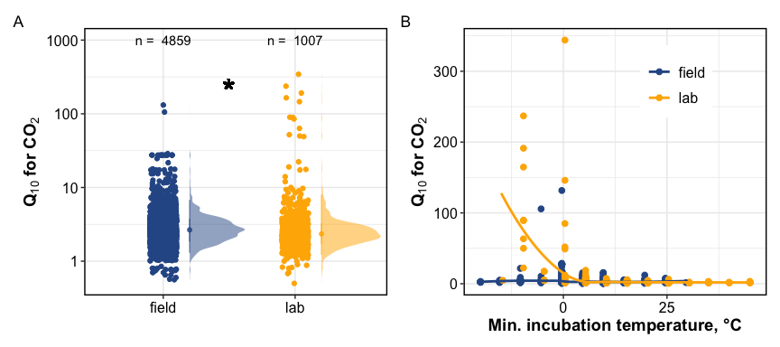
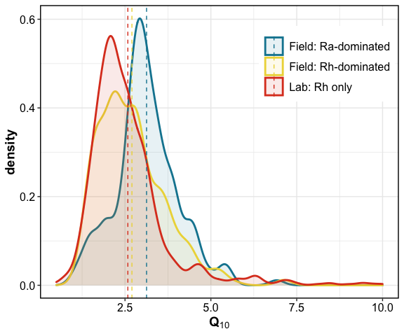

data analysis
================

------------------------------------------------------------------------

## EXPLORATION

### 1. Study sites

<!-- -->

### 2. Studies by Climate

#### 2.1. Climate regions

<!-- -->

#### 2.2. MAT-MAP spread of data

<!-- -->

### 3. How many datapoints?

Datapoints:

| Species | ClimateTypes | field | lab |
|:--------|:-------------|------:|----:|
| CO2     | equatorial   |    64 |  90 |
| CO2     | arid         |   165 |  45 |
| CO2     | temperate    |  1875 | 458 |
| CO2     | snow         |  2568 | 160 |
| CO2     | polar        |   120 | 113 |
| CO2     | NA           |    67 | 141 |
| CH4     | arid         |     2 |  12 |
| CH4     | temperate    |    11 |  42 |
| CH4     | snow         |    44 |  56 |
| CH4     | polar        |     2 |  13 |
| CH4     | NA           |     2 |   8 |
| CH4     | equatorial   |    NA |   1 |

total datapoints:

| Species | field |  lab |
|:--------|------:|-----:|
| CO2     |  4859 | 1007 |
| CH4     |    61 |  132 |

Studies:

| Species | ClimateTypes | field | lab |
|:--------|:-------------|------:|----:|
| CO2     | equatorial   |    19 |   9 |
| CO2     | arid         |    28 |   9 |
| CO2     | temperate    |   272 |  60 |
| CO2     | snow         |   235 |  28 |
| CO2     | polar        |    29 |  18 |
| CO2     | NA           |    11 |  24 |
| CH4     | arid         |     2 |   1 |
| CH4     | temperate    |     9 |   6 |
| CH4     | snow         |    11 |   8 |
| CH4     | polar        |     2 |   3 |
| CH4     | NA           |     2 |   3 |
| CH4     | equatorial   |    NA |   1 |

total studies:

| Species | field | lab |
|:--------|------:|----:|
| CO2     |   578 | 125 |
| CH4     |    26 |  21 |

### 4. Incubation Temperature Ranges

#### 4.1. summary of incubation temperatures

<!-- -->

#### 4.2. Q10 vs. incubation temperatures

<!-- -->

#### 4.3. incubation temperature ranges

<!-- -->

------------------------------------------------------------------------

------------------------------------------------------------------------

## Analysis

### 1. Summary tables

#### 1.1. Overall summary

| Species | name    |  field |    lab |
|:--------|:--------|-------:|-------:|
| CO2     | mean    |   3.05 |   4.19 |
| CO2     | median  |   2.66 |   2.35 |
| CO2     | perc_01 |   1.13 |   1.00 |
| CO2     | perc_25 |   2.03 |   1.90 |
| CO2     | perc_75 |   3.40 |   3.00 |
| CO2     | perc_99 |  10.54 |  49.94 |
| CO2     | min     |   0.56 |   0.50 |
| CO2     | max     | 131.63 | 344.00 |
| CH4     | mean    |   6.14 |   5.51 |
| CH4     | median  |   4.10 |   3.10 |
| CH4     | perc_01 |   0.92 |   1.05 |
| CH4     | perc_25 |   2.41 |   1.73 |
| CH4     | perc_75 |   5.31 |   5.75 |
| CH4     | perc_99 |  56.88 |  34.69 |
| CH4     | min     |   0.80 |  -2.10 |
| CH4     | max     |  71.00 |  83.00 |

#### 1.2. By biome

| Species | ClimateTypes | name   | field |  lab |
|:--------|:-------------|:-------|------:|-----:|
| CO2     | equatorial   | mean   |  2.78 | 2.39 |
| CO2     | arid         | mean   |  1.76 | 2.48 |
| CO2     | temperate    | mean   |  2.82 | 3.52 |
| CO2     | snow         | mean   |  3.30 | 7.95 |
| CO2     | polar        | mean   |  3.37 | 5.69 |
| CO2     | NA           | mean   |  2.50 | 2.56 |
| CO2     | equatorial   | median |  2.01 | 2.32 |
| CO2     | arid         | median |  1.62 | 2.50 |
| CO2     | temperate    | median |  2.56 | 2.44 |
| CO2     | snow         | median |  2.80 | 2.60 |
| CO2     | polar        | median |  2.76 | 2.20 |
| CO2     | NA           | median |  2.41 | 2.14 |

#### 1.3. By incubation temperature

| Species | Temp_range | name   | field |    lab |
|:--------|:-----------|:-------|------:|-------:|
| CO2     | \< 0       | mean   | 45.95 | 113.45 |
| CO2     | 0_5        | mean   | 27.79 |  59.42 |
| CO2     | 5_15       | mean   |  2.93 |   3.34 |
| CO2     | 15_25      | mean   |  2.54 |   2.29 |
| CO2     | \> 25      | mean   |  3.07 |   2.08 |
| CO2     | NA         | mean   |  2.93 |   2.65 |
| CO2     | \< 0       | median | 21.70 |  89.45 |
| CO2     | 0_5        | median | 27.50 |   8.95 |
| CO2     | 5_15       | median |  2.72 |   2.67 |
| CO2     | 15_25      | median |  2.60 |   2.20 |
| CO2     | \> 25      | median |  2.00 |   2.00 |
| CO2     | NA         | median |  2.64 |   2.44 |

### 2. CO2: All studies, all temperatures

We included all datapoints collected, irrespective of incubation
temperature range. (0-10 C, 0-15 C, 0-20 C, 10-20 C, 5-15 C, etc.)

**ANOVA**

    #> # A tibble: 1 × 6
    #>   term          df sumsq meansq statistic   p_value
    #>   <chr>      <dbl> <dbl>  <dbl>     <dbl>     <dbl>
    #> 1 Incubation     1 1081.  1081.      19.0 0.0000136

<!-- -->

### 3. CO2: Temp ranges of 10 C only

We then subset the data to include only incubations with temperature
ranges of 10 C.  
(0-10 C, 10-20 C, 5-15 C, 15-25 C, etc.)

<!-- -->

    #> # A tibble: 1 × 6
    #>   term          df sumsq meansq statistic       p_value
    #>   <chr>      <dbl> <dbl>  <dbl>     <dbl>         <dbl>
    #> 1 Incubation     1 2531.  2531.      33.1 0.00000000921

### 4. Grouping by biome

<!-- -->

#### 5. Grouping by Ecosystem type

<!-- -->

| Ecosystem_type | Incubation |      mean |    n |
|:---------------|:-----------|----------:|-----:|
| Agriculture    | field      |  2.720392 |  255 |
| Agriculture    | lab        |  2.469565 |   23 |
| Bare           | field      |  1.320000 |    3 |
| Cultivated     | lab        |  2.732333 |   60 |
| Desert         | field      |  1.537805 |   41 |
| Desert         | lab        | 22.417647 |   17 |
| Forest         | field      |  3.194554 | 3619 |
| Forest         | lab        |  2.580937 |  491 |
| Grassland      | field      |  2.557804 |  633 |
| Grassland      | lab        |  2.523393 |  112 |
| Savanna        | field      |  2.022941 |   17 |
| Shrubland      | field      |  2.937243 |  185 |
| Tundra         | field      | 12.250000 |    2 |
| Tundra         | lab        | 18.837778 |   54 |
| Wetland        | field      |  2.655882 |  102 |
| Wetland        | lab        |  7.395867 |   75 |
| NA             | field      |  2.250000 |    2 |
| NA             | lab        |  2.821486 |  175 |

#### 5. Grouping by Measurement type

<!-- -->

| Meas_method              |     mean |    n |
|:-------------------------|---------:|-----:|
| Alkali absorption        | 3.037165 |  582 |
| BaPS                     | 5.350000 |    4 |
| Gas chromatography       | 2.645363 |  593 |
| Gradient                 | 2.404545 |   33 |
| IRGA                     | 3.375672 | 4494 |
| IRMS                     | 2.000000 |    1 |
| oxygen microcompensation | 1.915000 |    2 |
| respirometer             | 3.000000 |    1 |
| TDLAS                    | 2.386250 |    8 |
| unknown                  | 2.759318 |   88 |
| Unknown                  | 2.508000 |   15 |
| NA                       | 2.672222 |   45 |

### 5. Subsetting by temperature range

We then subset the data to include only incubations with specific
temperature ranges: \< 5 C, 5-15 C, 15-25 C, \> 25C. These ranges were
chosen because these ranges had the highest frequency of data, and this
would also avoid issues pertaining to frozen soils (if we were tp choose
0-10 C).

<!-- -->

**ANOVA**

    #> # A tibble: 3 × 7
    #> # Groups:   Temp_range [3]
    #>   Temp_range term          df sumsq meansq statistic  p_value
    #>   <fct>      <chr>      <dbl> <dbl>  <dbl>     <dbl>    <dbl>
    #> 1 5_15       Incubation     1 25.3   25.3      12.2  0.000479
    #> 2 15_25      Incubation     1  3.13   3.13      2.65 0.105   
    #> 3 > 25       Incubation     1 13.3   13.3      13.4  0.000343

#### 5.1. Bootstrapping the data

The data were highly skewed toward the field measurements, because most
came from the highly curated SRDB. To do a more balanced analysis, we
did bootstrapping by randomly sampling 1000 times, 10 samples each.

<!-- --><!-- -->

**ANOVA on bootstrapped data**

    #> # A tibble: 3 × 7
    #> # Groups:   Temp_range [3]
    #>   Temp_range term          df sumsq meansq statistic p_value
    #>   <fct>      <chr>      <dbl> <dbl>  <dbl>     <dbl>   <dbl>
    #> 1 5_15       Incubation     1  797.   797.     2309.       0
    #> 2 15_25      Incubation     1  321.   321.     2099.       0
    #> 3 > 25       Incubation     1 4864.  4864.    17950.       0

#### 5.2 Combining non-bootstrap and bootstrap plots

<!-- -->

### 6. Heterotrophic respiration

The field measurements reported above included both autotrophic and
heterotrophic respiration, whereas the lab measurements refer only to
heterotrophic. We subset field measurements that were heterotrophic
respiration only, and compared that with lab.

The heterotrophic field measurements were available for temperate and
snow biomes only.

    #> # A tibble: 3 × 3
    #>   Rh_group             mean     n
    #>   <chr>               <dbl> <int>
    #> 1 Field: Ra-dominated  3.13   167
    #> 2 Field: Rh-dominated  2.70   581
    #> 3 Lab: Rh only         2.58   989

<!-- -->

-   How did field Rh vs. lab Rh compare?

<!-- -->

    #>               Df Sum Sq Mean Sq F value Pr(>F)  
    #> Rh_group       1    5.2   5.184   4.251 0.0394 *
    #> Residuals   1568 1912.0   1.219                 
    #> ---
    #> Signif. codes:  0 '***' 0.001 '**' 0.01 '*' 0.05 '.' 0.1 ' ' 1

-   How did field Rh vs. field Ra compare?

<!-- -->

    #>              Df Sum Sq Mean Sq F value   Pr(>F)    
    #> Rh_group      1   23.6  23.560   24.67 8.42e-07 ***
    #> Residuals   746  712.3   0.955                     
    #> ---
    #> Signif. codes:  0 '***' 0.001 '**' 0.01 '*' 0.05 '.' 0.1 ' ' 1
    #> # A tibble: 9 × 5
    #> # Groups:   Species [1]
    #>   Species name    `Field: Ra-dominated` `Field: Rh-dominated` `Lab: Rh only`
    #>   <fct>   <chr>                   <dbl>                 <dbl>          <dbl>
    #> 1 CO2     n                      167                   581            989   
    #> 2 CO2     mean                     3.13                  2.70           2.58
    #> 3 CO2     median                   3.06                  2.56           2.33
    #> 4 CO2     perc_01                  1.17                  1.3            1   
    #> 5 CO2     perc_25                  2.66                  2              1.9 
    #> 6 CO2     perc_75                  3.53                  3.22           2.94
    #> 7 CO2     perc_99                  5.42                  5.39           7.30
    #> 8 CO2     min                      1.04                  1.02           0.5 
    #> 9 CO2     max                      6.92                  7.12          10

------------------------------------------------------------------------

### 7. Analysis - CH4

<!-- -->

**ANOVA**

    #> # A tibble: 1 × 6
    #>   term          df sumsq meansq statistic p_value
    #>   <chr>      <dbl> <dbl>  <dbl>     <dbl>   <dbl>
    #> 1 Incubation     1  16.3   16.3     0.183   0.670

------------------------------------------------------------------------

Session Info

Date run: 2022-08-24

    #> R version 4.2.1 (2022-06-23)
    #> Platform: x86_64-apple-darwin17.0 (64-bit)
    #> Running under: macOS Catalina 10.15.7
    #> 
    #> Matrix products: default
    #> BLAS:   /System/Library/Frameworks/Accelerate.framework/Versions/A/Frameworks/vecLib.framework/Versions/A/libBLAS.dylib
    #> LAPACK: /Library/Frameworks/R.framework/Versions/4.2/Resources/lib/libRlapack.dylib
    #> 
    #> locale:
    #> [1] en_US.UTF-8/en_US.UTF-8/en_US.UTF-8/C/en_US.UTF-8/en_US.UTF-8
    #> 
    #> attached base packages:
    #> [1] stats     graphics  grDevices utils     datasets  methods   base     
    #> 
    #> other attached packages:
    #>  [1] patchwork_1.1.1         googlesheets4_1.0.0     data.table_1.14.2       sidb_1.0.0             
    #>  [5] sf_1.0-7                rnaturalearthdata_0.1.0 rnaturalearth_0.1.0     nlme_3.1-157           
    #>  [9] drake_7.13.3            forcats_0.5.1           stringr_1.4.0           dplyr_1.0.9            
    #> [13] purrr_0.3.4             readr_2.1.2             tidyr_1.2.0             tibble_3.1.8           
    #> [17] ggplot2_3.3.6           tidyverse_1.3.2        
    #> 
    #> loaded via a namespace (and not attached):
    #>  [1] googledrive_2.0.0    minqa_1.2.4          colorspace_2.0-3     ellipsis_0.3.2       class_7.3-20        
    #>  [6] fs_1.5.2             rstudioapi_0.13      proxy_0.4-27         farver_2.1.1         soilpalettes_0.1.0  
    #> [11] bit64_4.0.5          fansi_1.0.3          lubridate_1.8.0      xml2_1.3.3           splines_4.2.1       
    #> [16] rootSolve_1.8.2.3    knitr_1.39           jsonlite_1.8.0       broom_1.0.0          dbplyr_2.2.1        
    #> [21] ggdist_3.2.0         compiler_4.2.1       httr_1.4.3           backports_1.4.1      Matrix_1.4-1        
    #> [26] assertthat_0.2.1     fastmap_1.1.0        gargle_1.2.0         cli_3.3.0            s2_1.1.0            
    #> [31] htmltools_0.5.3      prettyunits_1.1.1    tools_4.2.1          igraph_1.3.4         coda_0.19-4         
    #> [36] gtable_0.3.0         glue_1.6.2           maps_3.4.0           wk_0.6.0             rappdirs_0.3.3      
    #> [41] Rcpp_1.0.9           cellranger_1.1.0     vctrs_0.4.1          xfun_0.31            rvest_1.0.2         
    #> [46] lifecycle_1.0.1      MASS_7.3-57          scales_1.2.0         vroom_1.5.7          hms_1.1.1           
    #> [51] parallel_4.2.1       yaml_2.3.5           curl_4.3.2           stringi_1.7.8        highr_0.9           
    #> [56] e1071_1.7-11         PNWColors_0.1.0      measurements_1.4.0   filelock_1.0.2       FME_1.3.6.2         
    #> [61] storr_1.2.5          rlang_1.0.4          pkgconfig_2.0.3      distributional_0.3.0 evaluate_0.15       
    #> [66] lattice_0.20-45      labeling_0.4.2       bit_4.0.4            tidyselect_1.1.2     deSolve_1.33        
    #> [71] magrittr_2.0.3       R6_2.5.1             generics_0.1.3       base64url_1.4        txtq_0.2.4          
    #> [76] DBI_1.1.3            pillar_1.8.0         haven_2.5.0          withr_2.5.0          mgcv_1.8-40         
    #> [81] units_0.8-0          sp_1.5-0             modelr_0.1.8         crayon_1.5.1         KernSmooth_2.23-20  
    #> [86] utf8_1.2.2           tzdb_0.3.0           rmarkdown_2.14       progress_1.2.2       grid_4.2.1          
    #> [91] readxl_1.4.0         minpack.lm_1.2-2     reprex_2.0.1         digest_0.6.29        classInt_0.4-7      
    #> [96] openssl_2.0.2        munsell_0.5.0        viridisLite_0.4.0    askpass_1.1

